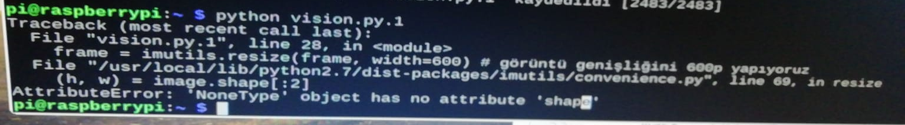
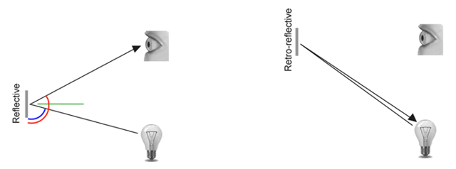
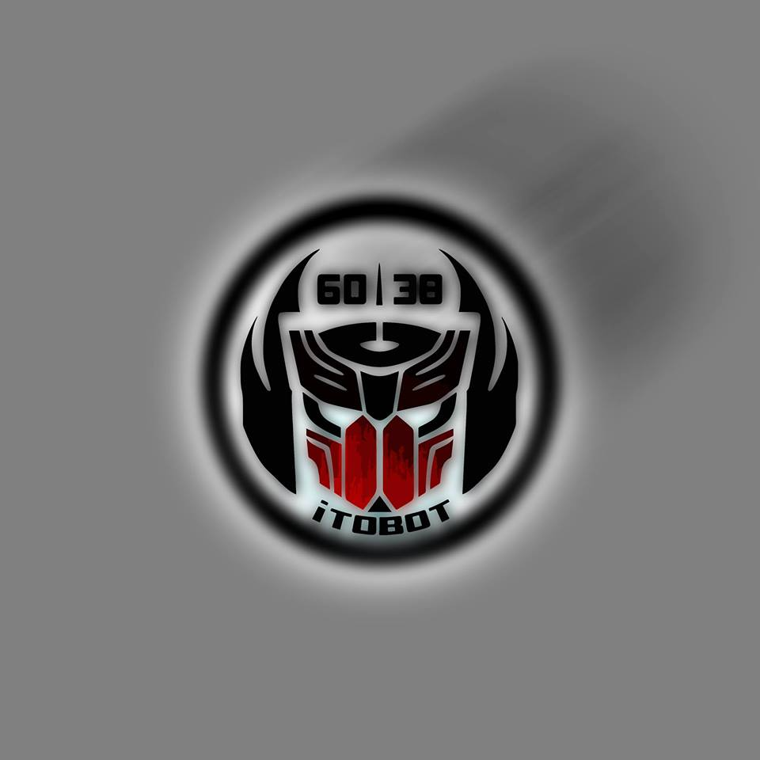

# Co-Processor - Hatalar ve Çözümleri

## Hatalar ve Çözümleri

### Hatalar ve Çözümleri

#### AttributeError: 'NoneType' object has no attribute 'shape' hatası



Bu hatayı alma sebebiniz yazılımımızın sizin kameranızı tanımamasından kaynaklanmaktadır. Kameranızı Raspberry Pi'ye taktıktan sonra konsola

`sudo apt-get update && sudo apt-get upgrade`

komutunu girmeniz gerekmektedir. Bu komut kameranız Raspberry Pi 'ye bağlıyken Raspi'nizi update edip gereklid driverleri indirmesini ve upgrade komutuyla kurmasını sağlayacaktır. Eğer kameranızı yine algılamazsa kodunuzda bulunan 

```python
camera = cv2.VideoCapture(0) #  webcamin bagli oldugu port varsayilan 0
```

satırındaki 0 numarasını 1 ile değiştirebilirsiniz. Raspberry Pi'de 4 port olduğu için 4'e kadar değiştirerek deneyebilirsiniz.

#### No module named 'networktables'


Eğer böyle bir hata ile karşılaşıyorsanız pynetworktables kütüphanesini kurarken sıkıntı yaşamışsınız demektir. 

`pip install pynetworktables`

Komutunu girip tekrar çalıştırmayı deneyin. Eğer aynı hatayı almaya devam ediyorsanız, muhtemelen kodu sudo komutuyla çalıştırmaya çalışıyorsunuzdur. Sudo ve normal işlem esnasında kullandığınız pi farklı kullanıcılardır. Sudo bütün yetkilere sahip olan kullanıcı anlamına gelmektedir. Sudo olarak çalıştırmak istiyorsanız , kütüphaneleri Sudo kullanıcısına tekrardan kurmanız gerekmektedir. Bunun için konsola şu komutları girmelisiniz.

`Sudo su`

Bu komut pi kullanıcısından sudo kullanıcısına geçmenizi sağladı. Şimdi bütün kütüphaneleri tekrardan pip komutu ile kurabilirsiniz.

#### IndentationError: unindent does not match any outer indentation level


Bu hata komutun başında bulunan boşlukları sildiğinizi veya fazladan boşluk koyduğunuz anlamına gelir. Python syntax'ı boşluklarla olduğu için yazdığınız komutu algılamaz. Boşlukları kontrol edip tekrar çalıştırmayı deneyin. Eğer boşluklarla ilgli bir problem göremezseniz herhangi bir Python editörü indirip editör ile kodlarınızı kontrol edebilirsiniz. Editörler bu tarz problemleri kendiliğinden fark edip düzeltirler.

#### Reflektörün beyaz yansıması


Bu problem bir çok farklı sebepten kaynaklanıyor olabilir.

Başlıca sebepleri:

* Kullandığınız ledlerin parlaklığı
* Kullandığınız ledlerin sayısı
* Kamera ve ledlerin konumu
* Kullandığınız reflector



Bunun için Wpilib'in yazdığı bir makale bulunmakta. Bu makaleyi okuyarak problemi çözebilirsiniz. 



Yaşadıkları problemleri ve çözümleri bizlere aktaran \#6038 ITOBOT takımına ve \#6025 Adroit Anroids takımına teşekkürler!




