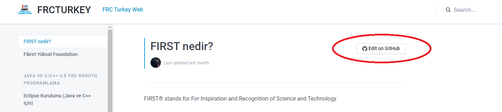
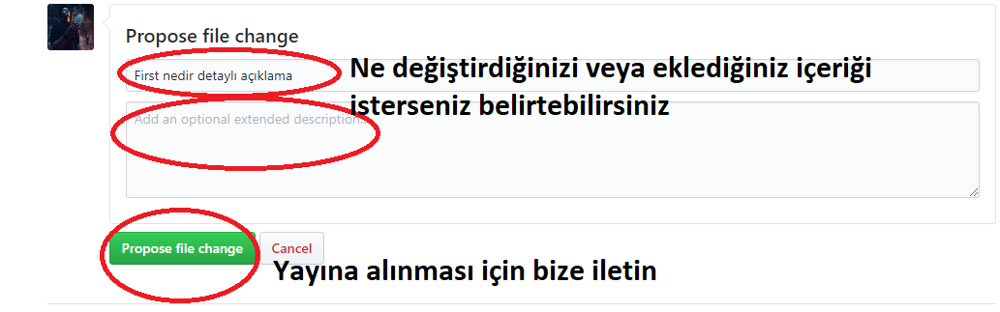
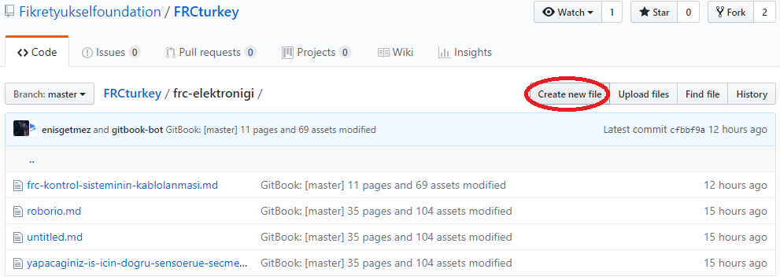
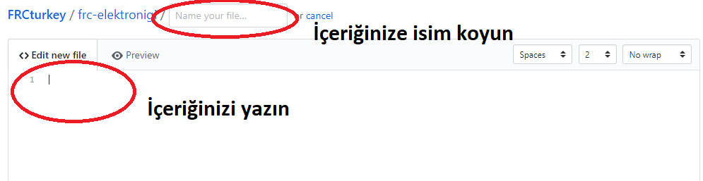
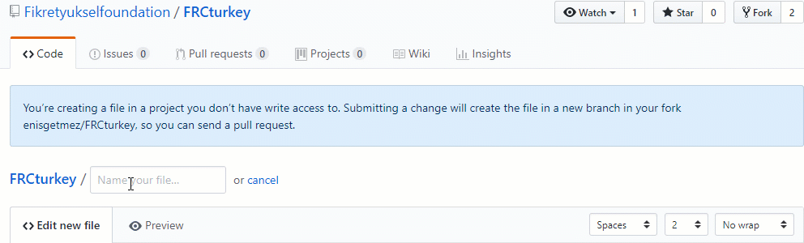

# Bu Sayfaya Nasıl İçerik Eklerim?

### Herhangi bir içeriği düzenlemek

Girdiğiniz içeriğin sağ üst kısmında bulunan Edit on Github butonuna tıklayarak ilgili github sayfasına gidebilirsiniz. Ardından edit butonuna basarak içeriğe eklemeler yapıp geliştirebilir veya hataları düzenleyebilirsiniz. 

**Not: İçerikler yetkili kişiler tarafından incelendikten sonra yayına alınacaktır.**

### Nasıl Kendi İçeriğimizi Ekleriz?

[https://github.com/Fikretyukselfoundation/FRCturkey](https://github.com/Fikretyukselfoundation/FRCturkey) adresine giderek uygun başlığa tıklayıp sağ üst köşede bulunan "create new file" butonuna basın. Ardından içeriğinizi ekleyip uygun bir isim verip kaydedin.

 **Not: İçerikler yetkili kişiler tarafından incelendikten sonra yayına alınacaktır.**

### İçeriğim hiç bir başlığa uymuyor

Frcturkey Repositoriesine gelip "create new file" butonuna basın. Ardından oluşturmak istediğiniz başlığı yazıp sonuna / ekleyip dosya adınızı ekleyin. Yani mekanik/cnc kullanımı.md gibi

. **Not: İçerikler yetkili kişiler tarafından incelendikten sonra yayına alınacaktır.**

### Bizim Size Sağladığımız Katkılar

Düzenlediğiniz, eklediğiniz içerikler için learn.frcturkey.com adresinde  içeriğinizin altına size veya takımınıza özel teşekkür ediyoruz. Aynı zamanda eğer yazılım ile ilgileniyorsanız github adresimize yaptığınız destek size ileride iş mülakatlarınız için github üzerinde iyi bir referans olacaktır.

