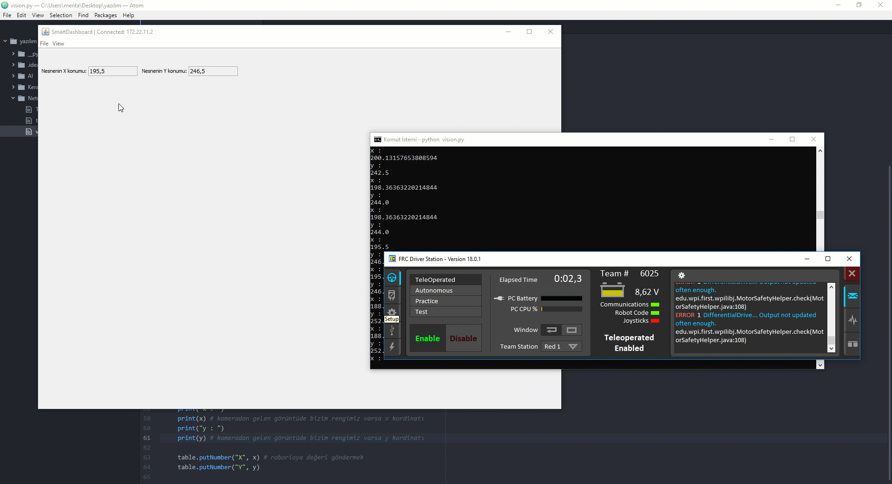

# Co-Processor - Raspberry Pi

## Raspberry Pi

Merhabalar, bu içerikte sizlerle daha önceden geliştirdiğimiz görüntü işleme komutlarını paylaşacağım. Öncelikle kodların tamamına ulaşmak isterseniz : [https://github.com/enisgetmez/FRC-Vision-Processing](https://github.com/enisgetmez/FRC-Vision-Processing) buradan ulaşabilirsiniz.

Bu kısmı buradan daha detaylı bir şekilde izleyebilirsiniz:




**Co-Processor olarak Raspberry PI kullanacağız.**

### Gerekli Kütüphanelerin Kurulması

Öncelikle görüntü işleme yapacağımız için OpenCV kütüphanelerinden faydalanacağız. OpenCV kütüphanelerinin çalışması için aynı zamanda Numpy kütüphanesini de kurmamız gerekmektedir.

  
Konsola girmemiz gereken komutlar şu şekildedir:  
`sudo apt install python-numpy python-opencv libopencv-dev`


y/n seçeneğine y yanıtını verelim. Bu işlem yaklaşık 5 dakika sürebilir.

Python için pip yani paket yöneticimizi indirmemiz gerekmektedir.

`sudo apt install python python-pip`

y/n seçeneğine y yanıtını verelim. Ardından

`pip install opencv-python`

`pip install pynetworktables`

`pip install imutils`

komutlarını girelim. **Eğer Python 3 kullanıyorsanız**, pip komutlarınız şu şekilde olmalı:

`pip3 install opencv-python`

`pip3 install pynetworktables`

`pip3 install imutils`

Her şey tamamlandıktan sonra bu adımda bitmiş demektir. Bir sonraki adıma geçebiliriz.

### Renk işleme için renk değerlerinin oluşturulması

En başta renk işlememiz için bize tanımlayacağımız rengin alt ve üst sınırları dediğimiz renk kodu gerekmektedir. Bunun için bir converter yazılımı mevcut. Kodlar bu şekildedir:

```python
import sys
import numpy as np
import cv2
 
blue = sys.argv[1]
green = sys.argv[2]
red = sys.argv[3]  
 
color = np.uint8([[[blue, green, red]]])
hsv_color = cv2.cvtColor(color, cv2.COLOR_BGR2HSV)
 
hue = hsv_color[0][0][0]
 
print("Lower bound is :"),
print("[" + str(hue-10) + ", 100, 100]\n")
 
print("Upper bound is :"),
print("[" + str(hue + 10) + ", 255, 255]")
```

 Dilerseniz [Github hesabımdan](https://raw.githubusercontent.com/enisgetmez/BAUROV-Autonomous/master/converter.py) bu kodlara ulaşabilirsiniz. Github üzerinden kolayca wget komutu ile indirebilirsiniz.

`wget` [`https://raw.githubusercontent.com/enisgetmez/BAUROV-Autonomous/master/converter.py`](https://raw.githubusercontent.com/enisgetmez/BAUROV-Autonomous/master/converter.py)\`\`

 Kullanımı ise şu şekildedir :


Algılatmak istediğiniz rengin kırmızı, yeşil, mavi renk değerlerini almalısınız. Ardından şu komutu kullanmalısınız:

`convert.py red green blue`

Lower bound ve upper bound dediğimiz renkleri kopyalayın. İleride kullanacağız.

### Renk İşleme

Kodlar java için şöyledir:

```java
package org.usfirst.frc.team6025.robot;

import edu.wpi.first.wpilibj.networktables.NetworkTable; // network table import
import edu.wpi.first.wpilibj.IterativeRobot;
import edu.wpi.first.wpilibj.Joystick;
import edu.wpi.first.wpilibj.Spark;
import edu.wpi.first.wpilibj.Timer;
import edu.wpi.first.wpilibj.command.Command;
import edu.wpi.first.wpilibj.drive.DifferentialDrive;
import edu.wpi.first.wpilibj.livewindow.LiveWindow;
import edu.wpi.first.wpilibj.smartdashboard.SendableChooser;
import edu.wpi.first.wpilibj.smartdashboard.SmartDashboard;


public class Robot extends IterativeRobot {
	private DifferentialDrive m_robotDrive
			= new DifferentialDrive(new Spark(0), new Spark(1));
	private Joystick m_stick = new Joystick(0);
	private Timer m_timer = new Timer();
	
	public static NetworkTable table1 = NetworkTable.getTable("Vision"); // vision adında table çekilioyr


	@Override
	public void robotInit() {
	}


	@Override
	public void autonomousInit() {
		m_timer.reset();
		m_timer.start();
	}
	
	public static double konumX()
	{
		return table1.getNumber("X", 0.0); //raspberry pi den gelen x kordinatları
	}
	public static double konumY() 
	{
		return table1.getNumber("Y", 0.0); //raspberry pi den gelen y kordinatları
	}


	@Override
	public void autonomousPeriodic() {
		// Drive for 2 seconds
		if (m_timer.get() < 2.0) {
			m_robotDrive.arcadeDrive(0.5, 0.0); // drive forwards half speed
		} else {
			m_robotDrive.stopMotor(); // stop robot
		}
	}

	@Override
	public void teleopInit() {
	}


	@Override
	public void teleopPeriodic() {
		SmartDashboard.putNumber("Nesnenin X konumu: ", konumX()); // smartdashboarda x konumu yazdır
		SmartDashboard.putNumber("Nesnenin Y konumu: ", konumY()); // smartdashboarda y konumunu yazdır

	}


	@Override
	public void testPeriodic() {
	}
}
```

Raspberry PI için python yazılımımız şu şekildedir : 

```python
#!/usr/bin/env python
# -*- coding: utf-8 -*-
from collections import deque
from networktables import NetworkTables
import numpy as np
import argparse
import cv2
import time
import imutils
x = 0 #programın ileride hata vermemesi için x 0 olarak tanımlıyorum
y = 0 # programın ileride hata vermemesi için y 0 olarak tanımlıyorum
NetworkTables.initialize(server='roborio-6025-frc.local') # Roborio ile iletişim kuruyoruz
table = NetworkTables.getTable("Vision") # table oluşturuyoruz

#sari rengin algilanmasi
colorLower = (24, 100, 100)
colorUpper = (44, 255, 255)
#converter.py ile convert ettiğiniz rengi buraya giriniz
camera = cv2.VideoCapture(0) #  webcamin bagli oldugu port varsayilan 0
while True: #yazılımımız çalıştığı sürece aşağıdaki işlemleri tekrarla


     (grabbed, frame) = camera.read() # grabbed ve frame değişkenini camera.read olarak tanımlıyoruz.

     frame = imutils.resize(frame, width=600) # görüntü genişliğini 600p yapıyoruz
     frame = imutils.rotate(frame, angle=0) # görüntüyü sabitliyoruz

     hsv = cv2.cvtColor(frame, cv2.COLOR_BGR2HSV) # görüntüyü hsv formatına çeviriyoruz

     mask = cv2.inRange(hsv, colorLower, colorUpper) # hsv formatına dönen görüntünün bizim belirttiğimiz renk sınırları içerisinde olanları belirliyor
     mask = cv2.erode(mask, None, iterations=2) # bizim renklerimizi işaretliyor
     mask = cv2.dilate(mask, None, iterations=2) # bizim renklerimizin genişliğini alıyor


     cnts = cv2.findContours(mask.copy(), cv2.RETR_EXTERNAL,
	 cv2.CHAIN_APPROX_SIMPLE)[-2]
     center = None


     if len(cnts) > 0:

		     c = max(cnts, key=cv2.contourArea)
		     ((x, y), radius) = cv2.minEnclosingCircle(c)
		     M = cv2.moments(c)
		     center = (int(M["m10"] / M["m00"]), int(M["m01"] / M["m00"]))


		     if radius > 10: #algılanacak hedefin minumum boyutu
			     cv2.circle(frame, (int(x), int(y)), int(radius),
				 (0, 255, 255), 2)
			     cv2.circle(frame, center, 5, (0, 0, 255), -1)
     else:
        x = 0 ##değerlerin sıfırlanması
        y = 0

     print("x : ")
     print(x) # kameradan gelen görüntüde bizim rengimiz varsa x kordinatı
     print("y : ")
     print(y) # kameradan gelen görüntüde bizim rengimiz varsa y kordinatı

     table.putNumber("X", x) # roborioya değeri göndermek
     table.putNumber("Y", y)
```

Komutların açıklamaları kod içerisinde bulunmaktadır. Eğer Raspberry PI için komutu otomatik olarak indirmek isterseniz wget komutunu kullanabilirsiniz.

`wget` [`https://raw.githubusercontent.com/enisgetmez/FRC-Vision-Processing/master/vision.py`](https://raw.githubusercontent.com/enisgetmez/FRC-Vision-Processing/master/vision.py)\`\`

Artık robotunuzu enable ettiğinizde , Raspberry PI üzerinden yazılımımızı çalıştırdığımızda değerler otomatik olarak smart dashboarda düşmeye başlayacaktır.

Kodunuzu Raspberry PI üzerinden çalıştırmak için:

`python yazilimadi.py`

Şeklinde kullanmanız gerekmektedir. Eğer wget komutunu kullandıysanız yazılım otomatik olarak vision.py olarak gelecektir. Yani çalıştırmak için:

`python vision.py`

komutunu kullanmanız yeterli olacaktır. 

#### Raspberry Pi kod düzenleme\(opsiyonel\)

Raspberry Pi ile gelen kodu düzenlemek isterseniz nano komutunu kullanarak düzenleyebilirsiniz. 

`nano vision.py`

Komutunu girip düzenleyeceğiniz satırı düzenledikten sonra ctrl-x tuşlarıyla çıkış yapabilirsiniz. 




### Şekil İşleme

```python
#!/usr/bin/env python
# -*- coding: utf-8 -*-
import numpy as np
import argparse
import cv2
import cv2 as CV 
from networktables import NetworkTables


NetworkTables.initialize(server='roborio-6025-frc.local') # Roborio ile iletişim kuruyoruz
table = NetworkTables.getTable("Vision") # table oluşturuyoruz

cap = cv2.VideoCapture(0) # webcamin bagli oldugu port


while(True):
	# goruntu yakalama
	ret, frame = cap.read()

	# goruntuyu grilestir
			
	output = frame.copy()
	gray = cv2.cvtColor(frame, cv2.COLOR_BGR2GRAY)
	
	# goruntuyu blurlastir
	gray = cv2.GaussianBlur(gray,(5,5),0);
	gray = cv2.medianBlur(gray,5)

	gray = cv2.adaptiveThreshold(gray,255,cv2.ADAPTIVE_THRESH_GAUSSIAN_C,\
            cv2.THRESH_BINARY,11,3.5)
	
	kernel = np.ones((5,5),np.uint8)
	gray = cv2.erode(gray,kernel,iterations = 1)

	gray = cv2.dilate(gray,kernel,iterations = 1)
	circles = cv2.HoughCircles(gray, cv2.cv.CV_HOUGH_GRADIENT, 1, 20, param1=50, param2=30, minRadius=0, maxRadius=0) #python2 icin
#	circles = cv2.HoughCircles(gray, cv2.HOUGH_GRADIENT, 1, 20, param1=40, param2=45, minRadius=0, maxRadius=0) # python3 icin 
    # (x−xcenter)2+(y−ycenter)2=r2   (xcenter,ycenter) 
	# kalibre
	# daireyi isle
	
	if circles is not None:

		circles = np.round(circles[0, :]).astype("int")
		
		
		for (x, y, r) in circles:
	
			cv2.circle(output, (x, y), r, (0, 255, 0), 4)
			cv2.rectangle(output, (x - 5, y - 5), (x + 5, y + 5), (0, 128, 255), -1)

			
			print ("X kordinat: ")
			print (x) # x kordinatı
			print ("Y Kordinat: ")
			print (y) # y kordinatı
			print ("Radius: ")
			print (r) # cisimin büyüklüğü
			table.putNumber("X", x) # roborioya değeri göndermek
			table.putNumber("Y", y)
			#cv2.imshow('frame',output) # ekranda göster
			if cv2.waitKey(1) & 0xFF == ord('q'):
				break
cap.release()
cv2.destroyAllWindows()
```

Komutların açıklamaları kod içerisinde bulunmaktadır. Eğer Raspberry PI için komutu otomatik olarak indirmek isterseniz wget komutunu kullanabilirsiniz.

`wget` [`https://raw.githubusercontent.com/enisgetmez/FRC-Vision-Processing/master/circle.py`](https://raw.githubusercontent.com/enisgetmez/FRC-Vision-Processing/master/circle.py)\`\`

Artık robotunuzu enable ettiğinizde , Raspberry PI üzerinden yazılımımızı çalıştırdığımızda değerler otomatik olarak smart dashboarda düşmeye başlayacaktır.

Kodunuzu Raspberry PI üzerinden çalıştırmak için:

`python yazilimadi.py`

Şeklinde kullanmanız gerekmektedir. Eğer wget komutunu kullandıysanız yazılım otomatik olarak vision.py olarak gelecektir. Yani çalıştırmak için:

`python circle.py`

komutunu kullanmanız yeterli olacaktır. 


